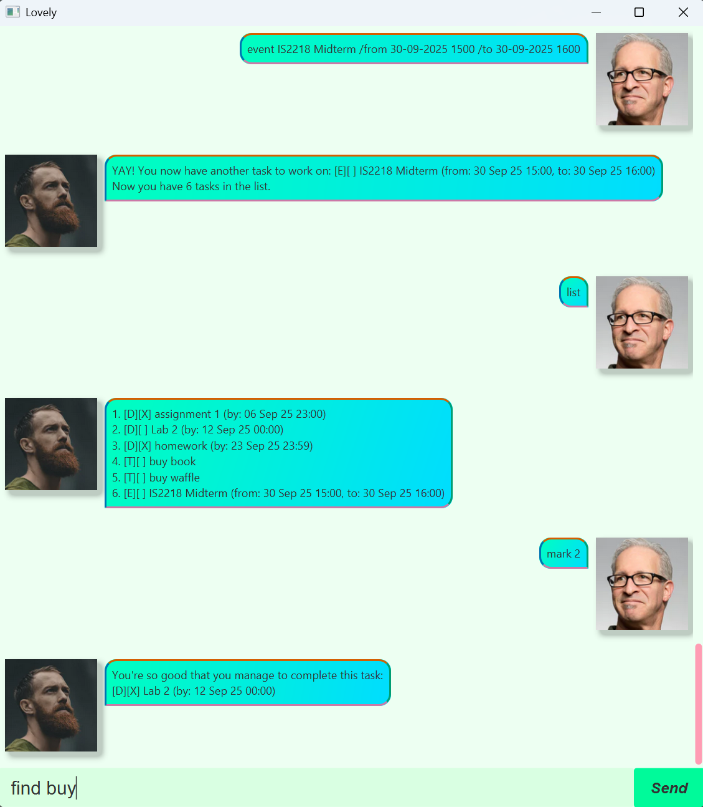

# 🌸 Welcome to Lovely

> "Hello! I'm Lovely. What can I do for you?"

**Lovely** is a delightful, conversational task manager that brings simplicity, charm, and efficiency to your daily life, all through a friendly chat interface.

Imagine having a personal assistant who remembers your deadlines, helps you stay organized, and even gives you gentle hints when you make a mistake. That’s **Lovely**, your cheerful companion for managing tasks, deadlines, and events all from the comfort of a clean, intuitive chat window.

---

## 🖼️ A Glimpse of the Experience

---

## ❤️ Why "Lovely"?

Because managing your life shouldn’t feel stressful. With **Lovely**, every task feels manageable, every deadline feels achievable, and every interaction feels… well, *lovely*.

Whether you're a student juggling assignments, a professional tracking deadlines, or just someone who likes to stay organized, **Lovely** is here to help you shine.

---

## ✨ Features

> 📌 All commands are case-insensitive. Index refers to the task number shown in the displayed list. Dates are parsed flexibly, see supported formats below.

---

### 🚪 Exit the Application

Safely shuts down the app. Your tasks are auto-saved before you leave. ✅

**Command**: `bye`

**Example**:
- `bye` - 👋 Exits the program.

> 💡 **Tip**: No data loss — everything’s saved before you go!

---

### 📋 View All Tasks

Displays your full task list with status ✅/❌, type, name, and due date/time (if any).

**Command**: `list`

**Example**:
- `list` - 🖥️ Shows all tasks with their indices.

---

### ✅ Mark a Task as Done

Celebrate progress! Mark any task as completed.

**Command**: `mark INDEX`

**Example**:
- `mark 3` - 🎯 Marks the 3rd task as done.

> 💡 **Tip**: Batch-mark tasks with repeated commands: `mark 1`, `mark 2`, etc.

---

### ❌ Mark a Task as Not Done

Changed your mind? Re-open a completed task.

**Command**: `unmark INDEX`

**Example**:
- `unmark 2` - ↩️ Marks the 2nd task as not done.

---

### 📝 Add a To-Do Task

Quickly add simple tasks with no deadlines.

**Command**: `todo TASK_NAME`

**Example**:
- `todo read book` - 📚 Adds a to-do task named “read book”.

---

### ⏰ Add a Deadline Task

Never miss a due date again! Add tasks with deadlines.

**Command**: `deadline TASK_NAME /by DATE`

**Example**:
- `deadline submit report /by 02-05-2025 1300` - 🗓️ Due by 1 PM
- `deadline pay bills /by 15/06/2025` - 💸 Due June 15

> 💡 **Tip**: Supported date formats:
> - `dd-MM-yyyy HHmm` → `02-05-2025 1300` 🕐
> - `dd-MM-yyyy` → `02-05-2025` 📅
> - `dd/MM/yyyy` → `02/05/2025` 🇬🇧
> - `dd/MM/yyyy HH:mm` → `02/05/2025 13:00` ⏱️

---

### 🎉 Add an Event Task

Schedule events with start and end times, perfect for meetings, trips, or parties!

**Command**: `event TASK_NAME /from START_DATE /to END_DATE`

**Example**:
- `event team meeting /from 03-05-2025 0900 /to 03-05-2025 1100` - 👥 9 AM to 11 AM
- `event vacation /from 10/07/2025 /to 20/07/2025` - ✈️ 10-day getaway

> 💡 **Tip**: When sorting by date, the **end date** (`/to`) is used ⏭️

---

### 🗑️ Delete a Task

Remove tasks you no longer need.

**Command**: `delete INDEX`

**Example**:
- `delete 1` - 💥 Removes the first task.

> ⚠️ **Warning**: No undo! Double check before deleting 🙏

---

### 🔍 Search for Tasks

Find tasks by keyword - fast and non-fuzzy (case-insensitive!).

**Command**: `find KEYWORD`

**Example**:
- `find book` - 📖 Shows “read book”, “buy textbook”, etc.

---

### 🔤 Sort Tasks by Name

Alphabetize your chaos! Sort tasks A → Z by name.

**Command**: `sort name`

**Example**:
- `sort name` - 🅰️🅱️ Sorts all tasks alphabetically.

---

### 📅 Sort Tasks by Date

Organize by time! Tasks ordered from soonest to latest:

- Deadlines → by due date ⏳
- Events → by **end date** 🎯
- To-do (no date) → last 🧩

**Command**: `sort date`

**Example**:
- `sort date` - ⏱️ Chronological order from earliest to latest.

---

### 💾 Auto-Save Your Data

Never lose progress! Every change is saved automatically to your disk.

**Save Location**:
``[JAR file location]/data/taskData.txt``

> 💡 **Tip**: Runs after every command. No “save” button needed! 🤖✅

---

## 📋 Command Summary

| Action         | Command & Example |
|----------------|-------------------|
| Add To-Do      | `todo read book` |
| Add Deadline   | `deadline submit report /by 02-05-2025 1300` |
| Add Event      | `event team meeting /from 03-05-2025 0900 /to 03-05-2025 1100` |
| Delete Task    | `delete 3` |
| Mark Done      | `mark 2` |
| Unmark Task    | `unmark 1` |
| Find Tasks     | `find book` |
| List All       | `list` |
| Sort by Name   | `sort name` |
| Sort by Date   | `sort date` |
| Exit Program   | `bye` |
